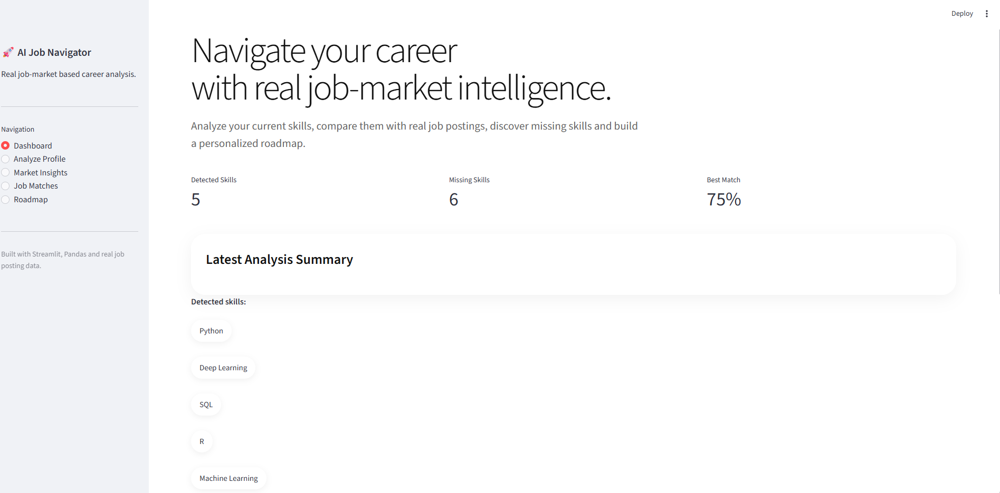
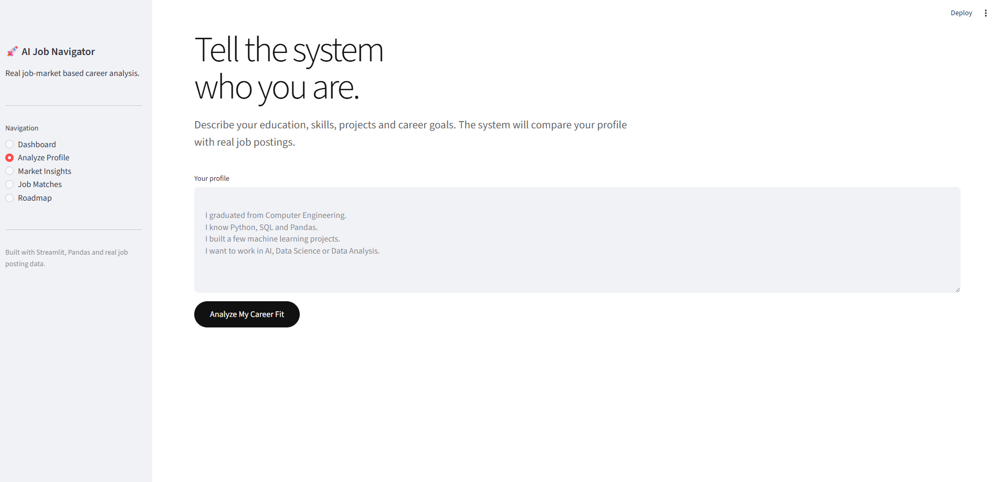
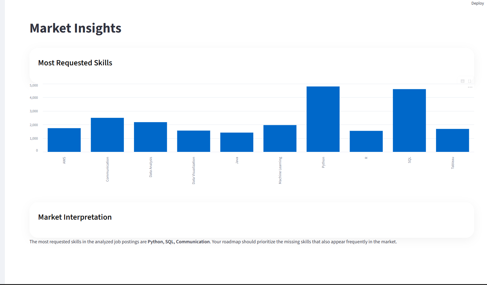
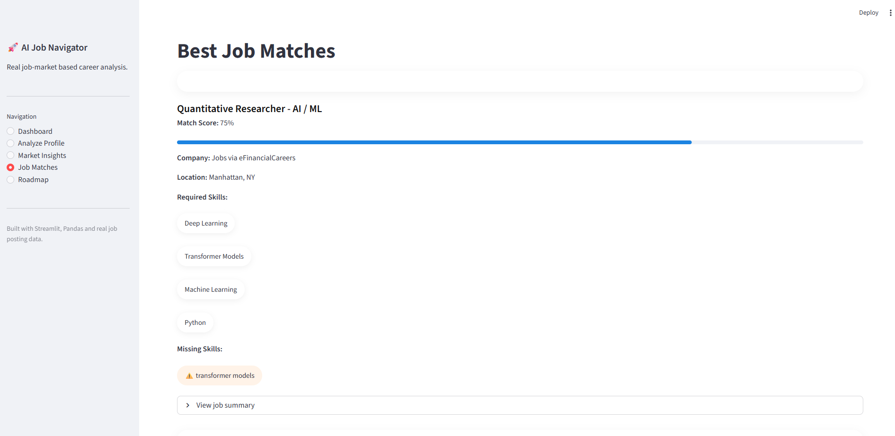

# 🚀 AI Job Market Navigator

AI Job Market Navigator is a Streamlit-based career intelligence platform that analyzes real job postings, detects missing market-demanded skills, matches users with relevant roles, and generates personalized career roadmaps.

This project was built to help new engineering graduates and junior candidates understand what the job market expects from them and how they can improve their profiles strategically.

---

## 📸 Screenshots

### Dashboard



### Profile Analysis



### Market Insights



### Job Matching



---

## ✨ Features

- Real job posting analysis
- Skill extraction from user profile text
- Market-demanded skill detection
- Missing skill analysis
- Job matching with match scores
- Personalized career roadmap generation
- Interactive Streamlit dashboard
- Modern and clean UI design

---

## 🧠 How It Works

1. The user enters their background, skills, projects, and career goals.
2. The system extracts detected skills from the user profile.
3. Real job posting datasets are analyzed.
4. The most requested market skills are identified.
5. Missing skills are detected by comparing the user profile with market demand.
6. Relevant job matches are calculated.
7. A personalized learning roadmap is generated.

---

## 🛠️ Technologies Used

- Python
- Streamlit
- Pandas
- NumPy
- Real-world job posting dataset
- NLP-inspired skill extraction
- Job matching logic
- Data visualization

---

## 📂 Project Structure

```text
AI-Job-Market-Navigator/

├── app.py
├── requirements.txt
├── README.md
├── .gitignore
│
├── ai/
│   └── skill_extractor.py
│
├── logic/
│   ├── job_market_engine.py
│   ├── skill_gap_analyzer.py
│   ├── job_matcher.py
│   └── roadmap_builder.py
│
├── data/
│   ├── job_postings.csv
│   ├── job_skills.csv
│   └── job_summary.csv
│
└── screenshots/
    ├── dashboard.png
    ├── analysis.png
    ├── market.png
    └── jobs.png
```

---

## 🚀 Installation

Clone the repository:

```bash
git clone https://github.com/Beyzajjk/AI-Job-Market-Navigator.git
```

Go to the project folder:

```bash
cd AI-Job-Market-Navigator
```

Install dependencies:

```bash
pip install -r requirements.txt
```

Run the app:

```bash
streamlit run app.py
```

---

## 📊 Dataset

This project uses real job posting data to analyze market-demanded skills and job requirements.

The dataset includes:

- Job postings
- Job skills
- Job summaries

---

## 🎯 Use Case

This project is designed for:

- New graduates
- Junior candidates
- Career changers
- People trying to understand what skills the job market expects
- Candidates who want to build a focused learning roadmap

---

## 🔮 Future Improvements

- Multi-domain career analysis
- Resume/CV analyzer
- GitHub portfolio analyzer
- Semantic skill matching
- LLM-powered career report generation
- Real-time job posting integration
- Deployment on Streamlit Cloud

---

## 👩‍💻 Author

Developed by **Beyzanur Akkalın**

GitHub: [Beyzajjk](https://github.com/Beyzajjk)